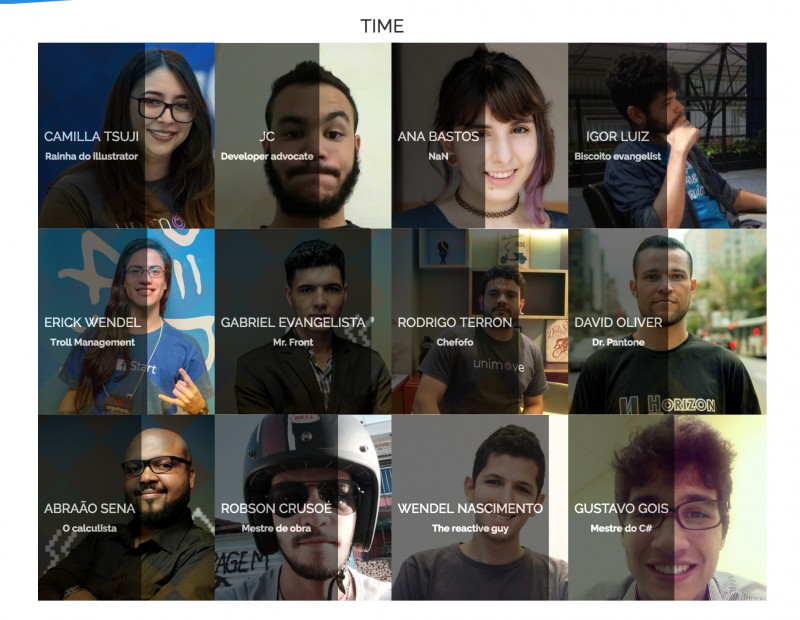

# Guia da Horizon Four

O que é a horizon?

## [Nosso culture code](culture.md)
## Time
Escolha seu nickname e foto para o Website da [horizonfour.com.br](http://horizonfour.com.br)

## Processos
[Assim como o spotify separamos nossas equipes em squads.](https://labs.spotify.com/2014/03/27/spotify-engineering-culture-part-1)

Squads são autonomos e tem liberdade de tecnologias desde que convença que a solução é apropriada e vai resolver o problema, fica mais aberto ainda quando é um produto interno que vai ser desenvolvido pelo próprio time.

Além disso, os squads são responsavéis pelos seus próprios metodos de entrega, portanto, se scrum for apropriado o time vai usar scrum, se alguem sugerir  que uma ferramenta pode resolver melhor os problemas o time deve estar aberto para usar esta ferramenta.

É importante sempre ficar de olho antes de sair de casa os meios de comunicação do seu time em especifico para saber para onde o time vai hoje já que existe a possibilidade do time, ou parte dele, estar em cliente.

Squads atuais:
- Certificado Campinas
- Shawee
- [Kitado](squad_kitado.md)

### Lideres
Já que cada Squad segue seus próprios processos como manter a qualidade de todos os Squads? Para isso existe o grupo de lideres de conversar sobre as melhores formas melhorarem o proprio time, seja em organização, comunicação ou entrega.

### Talks
Procuramos organizar semanalmente talks dentro da Horizon Four.

[Neste link](https://github.com/horizonfour/talks) colocamos algumas palestras internas que tivemos.

#### Internas
As talks internas servem como forma estimular o time a criar e compartilhar conteúdo, sendo uma otima oportunidade para treinar falar em publico, organizar ideias, etc.
Para sugerir uma talk ou se prontificar para dar uma basta enviar pelo canal no Slack, pode ser conteúdo tecnico ou não tecnico, avançado ou iniciante, teorico ou prático. Tanto faz :smile:
Geralmente fazemos de sexta-feira no fim da tarde e o time sempre vai procurar estar 100% presente neste horário para ver a talk.

#### Externas
É altamente estimulado que pessoas de fora também palestrem dentro da H4, essas pessoas além agregar coisas de fora ainda nós forçam a melhorar ainda mais. 
Talks externas podem ser feitas por qualquer pessoa interessada, essas pessoas podem ser desde alguem de seu colega de outra empresa que pode agregar até alguem muito top, e todo mundo tem a liberdade de chamar pessoas para dar talks internas.

### Challenges
Procuramos sempre incentivar a logica e curiosidade. Portanto organizamos [neste repositorio](https://github.com/horizonfour/talks) semanalmente desafios de algoritmos e logicas para serem resolvidos.
Deve-se fazer TDD da sua logica e se é altamente estimulado que voce o desafio para aprender uma linguagem nova.

### Feedbacks
Todo mes a Horizon procura dar feedbacks, receber feedbacks(negativos ou positivos) e sugestões de todas as pessoas da equipe. Dessa forma podemos sempre estar corrigindo os erros, melhorando o que falta e mantendo o que é bom.

## Comunicação

### Grupo do Whatsapp

Temos um grupo do Whatsapp que usamos para a comunicação geral do time sem formalidades.
Para entrar basta avisar alguem da equipe que você ainda não está no grupo do whatsapp.

### Slack

Channels dentro do slack:

- **General**

Assuntos gerais, informações de escopo de time e etc.
- **Desafios**

Sugestão de desafios, conversa sobre os desafios.
- **Talks**

Submissão de talks, sugestão de palestrantes e conteúdo.

- **Development**

Conversas sobre desenvolvimento

- **Comercial**

Conversas sobre comercial

- **Criação**

Conversas sobre criação

- **Design**

Conversas sobre design

- **Reuniões**

Alinhamento de reuniões

- **Estudo**

Compartilhamento de conteúdo de estudo

- **Eventos**

Compartilhamento de eventos de tecnologia

- **Random**

Aleatório ou ~a zueira~

- **Especificos**

Para cada squad existe um channel no slack

## Sugestões?
Qualquer sugestão de coisas a serem implementadas são bem vindas.
